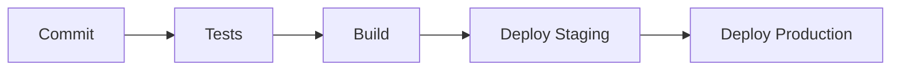

# 🏭 **LAMBOL - Mining Data Centralization System**

## 📋 **Overview**

**LAMBOL** is a comprehensive data centralization system designed specifically for mining operations. It aims to optimize the management of weighing records, laboratory analysis, and accounting information by integrating all these modules into a unified platform. With a modular architecture, real-time data processing, and advanced analysis capabilities, **LAMBOL** provides a powerful solution for modern mining operations.

---

**Table of Contents**:

- [🏭 **LAMBOL - Mining Data Centralization System**](#-lambol---mining-data-centralization-system)
  - [📋 **Overview**](#-overview)
  - [📌 Prerequisites](#-prerequisites)
  - [🔧 Installation](#-installation)
  - [🏗️ Project Architecture](#️-project-architecture)
  - [🚀 Features](#-features)
  - [🛠️ Tech Stack \& Versions](#️-tech-stack--versions)
  - [📦 Core Technologies](#-core-technologies)
  - [🧪 Testing](#-testing)
  - [🌐 API Documentation](#-api-documentation)
  - [🔄 Database Migrations](#-database-migrations)
  - [🔐 Environment Variables](#-environment-variables)
  - [🔄 **CI/CD Pipeline**](#-cicd-pipeline)
  - [🤝 Contributing](#-contributing)
  - [📄 License](#-license)

---

## 📌 Prerequisites

Ensure the following versions are installed in your development environment:

```bash
# Core
Node.js >= 18.x
PostgreSQL >= 14.x
Redis >= 6.x

# Development Tools
Docker >= 20.10.x
Docker Compose >= 2.x
npm >= 9.x
```

---

## 🔧 Installation

1. **Clone the repository**:

   ```bash
   git clone https://github.com/lambol-mining/data-centralization.git
   cd data-centralization
   ```

2. **Install dependencies**:

   ```bash
   yarn install
   ```

3. **Configure environment variables**:

   ```bash
   cp .env.example .env
   ```

4. **Initialize the database**:

   ```bash
   cd DATABASE
   npm run migrate
   ```

5. **Start the development servers**:

   ```bash
   # Start backend
   cd BACKEND
   yarn run dev

   # Start frontend
   cd FRONTEND
   yarn run dev
   ```

---

## 🏗️ Project Architecture

This project follows a monorepo structure based on **Screaming Architecture** and **Atomic Design** principles, which allows for scalable and maintainable development.

<details>
<summary><strong>📂 Project Structure</strong></summary>

```bash
lambol/
├── BACKEND/                       # Main backend modules and configuration
│   ├── domains/                   # Domain-specific logic (organized by feature/domain)
│   │   ├── accounting/            # Accounting domain
│   │   ├── auth/                  # Authentication domain
│   │   ├── laboratory/            # Laboratory analysis domain
│   │   └── weighing/              # Weighing management domain
│   ├── common/                    # Shared modules (helpers, utils, middleware)
│   │   ├── utils/                 # Utility functions and helpers
│   │   └── middleware/            # Middleware functions
│   ├── config/                    # Configuration files for the backend
│   │   ├── settings.json          # General settings in JSON format
│   │   └── settings.yaml          # General settings in YAML format (alternative)
│   ├── scripts/                   # Automation and deployment scripts
│   ├── tests/                     # Tests for backend modules
│   │   ├── test_accounting/       # Tests for accounting domain
│   │   ├── test_auth/             # Tests for authentication domain
│   │   ├── test_laboratory/       # Tests for laboratory domain
│   │   └── test_weighing/         # Tests for weighing domain
│   └── api/                       # API definitions and endpoints
│       ├── routes/                # API route definitions
│       ├── controllers/           # Request handlers and business logic
│       └── schemas/               # Data validation schemas
│
├── DATABASE/                      # Database configuration and management
│   ├── migrations/                # Database migration files
│   ├── seeds/                     # Initial data seeding files
│   └── scripts/                   # Database management scripts
│       ├── init_db.sh             # Script to initialize the database
│       └── backup_db.sh           # Script to backup the database
│
├── FRONTEND/                      # Frontend application
│   ├── public/                    # Public assets (index.html, favicon, etc.)
│   └── src/                       # Frontend source code
│       ├── ui/                    # UI components and Atomic Design structure
│       │   ├── components/        # All components following Atomic Design
│       │   │   ├── atoms/         # Basic elements (e.g., buttons, inputs)
│       │   │   ├── molecules/     # Combined elements (e.g., form groups)
│       │   │   ├── organisms/     # Complex elements (e.g., navigation bars)
│       │   │   └── templates/     # Page templates (e.g., main layout)
│       │   └── pages/             # Complete pages (e.g., HomePage, Dashboard)
│       ├── assets/                # Static assets like images, fonts, etc.
│       ├── config/                # Frontend configuration files
│       ├── styles/                # Global and component-level styles
│       ├── utils/                 # Helper functions and utilities for the frontend
│       └── tests/                 # Tests for frontend components and pages
│           ├── unit/              # Unit tests for individual components
│           └── integration/       # Integration tests for complete pages
│
├── .devcontainer/                 # Containerized development environment configuration
│   ├── devcontainer.json          # Dev container configuration for VS Code
│   └── Dockerfile                 # Dockerfile for dev container setup
│
├── .github/                       # GitHub-specific files (e.g., workflows)
│   └── workflows/                 # CI/CD workflow files for GitHub Actions
├── docs/                          # Project documentation (user guides, API docs, etc.)
├── scripts/                       # Project-wide automation scripts
│   ├── setup.sh                   # Initial setup script
│   ├── deploy.sh                  # Deployment script
│   └── lint.sh                    # Linting and formatting script
├── static/                        # Static files shared across the project (e.g., logos)
├── configs/                       # General configuration files for the project
├── docker-compose.yml             # Docker Compose file for multi-container setup
├── Dockerfile                     # Dockerfile for containerizing the application
├── .env.example                   # Example environment variables file
├── README.md                      # Project overview and setup instructions
├── CHANGELOG.md                   # Log of changes and version history
└── LICENSE                        # License specifying the terms of use
```

</details>

---

## 🚀 Features

- **Centralized Data Management**: Integration of weighing records, laboratory analysis, and accounting information.
- **Real-Time Processing**: Automatic data validation and synchronization across modules.
- **Analysis and Reporting**: Generate customized reports and interactive dashboards.

---

## 🛠️ Tech Stack & Versions

## 📦 Core Technologies

| **Backend** | **Frontend** | **Database** | **Infrastructure/DevOps** | **Testing & Documentation** |
| ----------- | ------------ | ------------ | ------------------------- | --------------------------- |
| Nest.js     | React        | PostgreSQL   | Docker                    | Jest                        |
| GraphQL     | Next.js      | Redis        | Docker Compose            | Storybook                   |
|             | Tailwind CSS |              |                           | ESLint                      |

---

## 🧪 Testing

Run tests for backend and frontend:

```bash
# Run all tests
npm run test

# Backend tests
cd BACKEND
yarn run test

# Frontend tests
cd FRONTEND
npm run test         # Unit tests
npm run test:e2e     # End-to-End tests
npm run storybook    # Storybook testing
```

---

## 🌐 API Documentation

API documentation (OpenAPI/Swagger) is available at:

- **Development**: `http://localhost:3000/api/docs`
- **Staging**: `https://staging.lambol.com/api/docs`

---

## 🔄 Database Migrations

Manage database migrations:

```bash
# Create a new migration
cd DATABASE
npm run migration:create

# Run migrations
npm run migration:up

# Revert migrations
npm run migration:down
```

---

## 🔐 Environment Variables

Important environment variables:

```env
# Database
DB_HOST=localhost
DB_PORT=5432
DB_NAME=lambol_db
DB_USER=postgres
DB_PASSWORD=your_password

# Backend
PORT=3000
NODE_ENV=development

# Frontend
VITE_API_BASE_URL=http://localhost:3000
```

---

## 🔄 **CI/CD Pipeline**



---

## 🤝 Contributing

We welcome contributions! Please read our [Contribution Guide](docs/contributing.md) for guidelines on submitting pull requests.

---

## 📄 License

**LAMBOL** is open-sourced software licensed under the **MIT license**. See the [LICENSE](LICENSE) file for more information.

---
