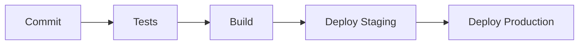

# 🏭 **LAMBOL - Mining Data Centralization System**

## 📋 **Overview**

**LAMBOL** es un sistema integral de centralización de datos diseñado específicamente para operaciones mineras. Su objetivo es optimizar la gestión de registros de pesaje, análisis de laboratorio e información contable, integrando todos estos módulos en una plataforma unificada. Con una arquitectura modular, procesamiento de datos en tiempo real y capacidades avanzadas de análisis, **LAMBOL** es una solución poderosa para la minería moderna.

---

## 🏗️ **Project Architecture**

Este proyecto sigue una estructura de monorepo basada en **Screaming Architecture** y **Atomic Design** para la interfaz. Esto permite un desarrollo escalable y fácil de mantener.

<details>
<summary><strong>📂 Estructura del proyecto</strong></summary>

```bash
lambol/
├── BACKEND/                       # Módulos principales del backend
│   ├── AUTH/                      # Dominio de autenticación
│   ├── WEIGHING/                  # Dominio de gestión de pesaje
│   ├── LABORATORY/                # Dominio de análisis de laboratorio
│   ├── ACCOUNTING/                # Dominio de contabilidad
│   └── COMMON/                    # Utilidades compartidas
│
├── FRONTEND/                      # Aplicación del frontend
│   ├── src/
│   │   ├── atoms/                 # Atomic Design - Componentes básicos
│   │   ├── molecules/             # Atomic Design - Componentes combinados
│   │   ├── organisms/             # Atomic Design - Componentes complejos
│   │   ├── templates/             # Atomic Design - Plantillas de página
│   │   ├── pages/                 # Páginas completas
│   │   └── features/              # Módulos por características
│   └── public/
│
└── DATABASE/                      # Configuraciones y scripts de la base de datos
    ├── migrations/
    ├── seeds/
    └── scripts/
```

</details>

---

## 🚀 **Features**

- **Centralized Data Management**
  - Integration of weighing records, laboratory analysis, and accounting information.
  - Storage of historical data for trend analysis.
- **Real-Time Processing**
  - Automatic data validation and synchronization between modules.
  - Live updates and notifications throughout the system.

- **Analysis and Reporting**
  - Generation of customized reports and interactive dashboards.
  - Data export capabilities for further analysis.

---

## 🛠️ **Tech Stack & Versions**

## 📦 Core Technologies

| Backend    | Frontend     | Database    |
| ---------- | ------------ | ----------- |
| Python 3.8 | React        | PostgreSQL  |
| FastAPI    | Next.js      | Redis       |
| SQLAlchemy | TypeScript   | TimescaleDB |
| Pydantic   | Tailwind CSS |             |

---

## 🧪 Development & Testing Tools

| Tool            | Purpose                         |
| --------------- | ------------------------------- |
| Docker          | Containerization                |
| Docker Compose  | Container orchestration         |
| GitHub Actions  | CI/CD                           |
| ESLint          | Frontend code quality           |
| Prettier        | Frontend code formatting        |
| Pylint          | Backend code quality            |
| Black           | Backend code formatting         |
| Pytest          | Backend testing                 |
| Pytest-Cov      | Test coverage                   |
| Pytest-Asyncio  | Asynchronous testing in Backend |
| Jest            | Frontend testing                |
| Testing Library | Frontend testing (React)        |
| Cypress         | Frontend E2E testing            |
| Storybook       | UI component testing            |

---

## 🎨 UI Components & Design

| Tool          | Purpose               |
| ------------- | --------------------- |
| shadcn/ui     | UI components         |
| Tailwind CSS  | UI styling and design |
| Framer Motion | Frontend animations   |
| Lucide-React  | Frontend icons        |
| Galileo AI    | UI/UX design          |
| Eraser.io     | Diagram creation      |
| Excalidraw    | Diagram creation      |
| Mermaid       | Diagrams in markdown  |
| dbdiagram.io  | Database design       |

---

## 🔍 Monitoring & Security

| Tool       | Purpose                     |
| ---------- | --------------------------- |
| Prometheus | Monitoring and metrics      |
| Grafana    | Metrics visualization       |
| OWASP ZAP  | Security (security testing) |
| Snyk       | Dependency security         |
| Dependabot | Dependency updates          |

## 📋 **Prerequisites**

Asegúrate de tener las siguientes versiones instaladas en tu entorno de desarrollo:

```bash
# Core
Node.js >= 18.x
Python >= 3.8
PostgreSQL >= 14.x
Redis >= 6.x

# Development Tools
Docker >= 20.10.x
Docker Compose >= 2.x
npm >= 9.x
```

---

## 🔧 **Installation**

1. **Clonar el repositorio**:

   ```bash
   git clone https://github.com/lambol-mining/data-centralization.git
   cd data-centralization
   ```

2. **Instalar dependencias**:

   ```bash
   yarn install
   ```

3. **Configurar variables de entorno**:

   ```bash
   cp .env.example .env
   ```

4. **Inicializar la base de datos**:

   ```bash
   cd DATABASE
   npm run migrate
   ```

5. **Iniciar los servidores de desarrollo**:

   ```bash
   # Iniciar backend
   cd BACKEND
   yarn run dev

   # Iniciar frontend
   cd FRONTEND
   yarn run dev
   ```

---

## 🧪 **Testing**

Para ejecutar pruebas en el backend y frontend:

```bash
# Ejecutar todas las pruebas
npm run test

# Pruebas del backend
cd BACKEND
poetry run pytest

# Pruebas del frontend
cd FRONTEND
npm run test         # Pruebas unitarias
npm run test:e2e     # Pruebas E2E
npm run storybook    # Testing de componentes
```

---

## 🌐 **API Documentation**

La documentación de la API (OpenAPI/Swagger) está disponible en:

- **Desarrollo**: `http://localhost:3000/api/docs`
- **Staging**: `https://staging.lambol.com/api/docs`

Incluye endpoints para:

- **Autenticación**
- **Gestión de pesaje**
- **Datos de laboratorio**
- **Integración contable**

---

## 🔄 **Database Migrations**

Comandos para gestionar migraciones de la base de datos:

```bash
# Crear una nueva migración
cd DATABASE
npm run migration:create

# Ejecutar migraciones
npm run migration:up

# Revertir migraciones
npm run migration:down
```

---

## 🔐 **Environment Variables**

Variables de entorno clave requeridas para la configuración:

```env
# Base de Datos
DB_HOST=localhost
DB_PORT=5432
DB_NAME=lambol_db
DB_USER=postgres
DB_PASSWORD=your_password

# Backend
PORT=3000
NODE_ENV=development
JWT_SECRET=your_jwt_secret

# Frontend
VITE_API_URL=http://localhost:3000
```

---

## 🔄 **CI/CD Pipeline**



---

## 🎨 **Design & Documentation Tools**

- **UI/UX Design**: Galileo AI
- **Creación de Diagramas**: Eraser.io, Excalidraw, Mermaid
- **Diseño de Bases de Datos**: dbdiagram.io
- **Desarrollo Asistido por AI**: GitHub Copilot, Vercel AI, Coditia AI

---

## 🤝 **Contributing**

1. **Fork del repositorio**
2. **Crear una rama de la nueva funcionalidad** (`git checkout -b feature/AmazingFeature`)
3. **Commit de los cambios** (`git commit -m 'Add some AmazingFeature'`)
4. **Push de la rama** (`git push origin feature/AmazingFeature`)
5. **Abrir un Pull Request**

---

## 👥 **Team**

- **Backend Lead**: [Nombre]
- **Frontend Lead**: [Nombre]
- **Database Architect**: [Nombre]
- **Project Manager**: [Nombre]

---

## 📄 **License**

Este proyecto está licenciado bajo la Licencia MIT - consulta el archivo [LICENSE](LICENSE) para más detalles.

---

## 📞 **Support**

Para soporte, contacta:

- **Soporte Técnico**: <joigfema@lambol.com>
- **Documentación**: [docs.lambol.com](https://docs.lambol.com)
- **Issue Tracker**: GitHub Issues

---
