# Planificación Scrum

| Cronograma de actividades |           |          | Inicio del proyecto: 04/11/2024                         |     |     |     |     |      | noviembre |          |          |          | diciembre |          |          |          | enero    |           |           |           | febrero   |           |           |           | marzo     |           |           |           | abril     |           |           |           | mayo      |           |           |           | junio     |           |           |           |
| ------------------------- | --------- | -------- | ------------------------------------------------------- | --- | --- | --- | --- | ---- | --------- | -------- | -------- | -------- | --------- | -------- | -------- | -------- | -------- | --------- | --------- | --------- | --------- | --------- | --------- | --------- | --------- | --------- | --------- | --------- | --------- | --------- | --------- | --------- | --------- | --------- | --------- | --------- | --------- | --------- | --------- | --------- |
| Actividades               | Fase      | sprint   | Descripción                                             | a   | m   | b   | Dij | Vij  | Semana 1  | Semana 2 | Semana 3 | Semana 4 | Semana 5  | Semana 6 | Semana 7 | Semana 8 | Semana 9 | Semana 10 | Semana 11 | Semana 12 | Semana 13 | Semana 14 | Semana 15 | Semana 16 | Semana 17 | Semana 18 | Semana 19 | Semana 20 | Semana 21 | Semana 22 | Semana 23 | Semana 24 | Semana 25 | Semana 26 | Semana 27 | Semana 28 | Semana 29 | Semana 30 | Semana 31 | Semana 32 |
| A                         | Prejuego  | Sprint 1 | Recopilación y análisis bibliográfico                   | 8   | 10  | 12  | 10  | 0.44 | [x]       | [x]      |          |          |           |          |          |          |          |           |           |           |           |           |           |           |           |           |           |           |           |           |           |           |           |           |           |           |           |           |           |           |
| B                         |           |          | Búsqueda de referencias                                 | 8   | 10  | 12  | 10  | 0.44 |           |          | [x]      |          |           |          |          |          |          |           |           |           |           |           |           |           |           |           |           |           |           |           |           |           |           |           |           |           |           |           |           |           |
| C                         |           |          | Elaboración del marco teórico                           | 4   | 5   | 6   | 5   | 0.11 |           |          |          | [x]      |           |          |          |          |          |           |           |           |           |           |           |           |           |           |           |           |           |           |           |           |           |           |           |           |           |           |           |           |
| D                         |           |          | Redacción de documentación                              | 115 | 118 | 120 | 240 | 0.69 | [x]       | [x]      | [x]      | [x]      | [x]       | [x]      | [x]      | [x]      | [x]      | [x]       | [x]       | [x]       | [x]       | [x]       | [x]       | [x]       | [x]       | [x]       | [x]       | [x]       | [x]       | [x]       | [x]       | [x]       | [x]       | [x]       | [x]       | [x]       | [x]       | [x]       | [x]       | [x]       |
| E                         |           | Sprint 2 | Planificación inicial del backlog                       | 8   | 10  | 12  | 10  | 0.44 |           |          |          |          | [x]       | [x]      |          |          |          |           |           |           |           |           |           |           |           |           |           |           |           |           |           |           |           |           |           |           |           |           |           |           |
| F                         |           |          | Diseño general del sistema                              | 8   | 10  | 12  | 10  | 0.44 |           |          |          |          | [x]       | [x]      | [x]      | [x]      |          |           |           |           |           |           |           |           |           |           |           |           |           |           |           |           |           |           |           |           |           |           |           |           |
| G                         | Juego     | Sprint 3 | Desarrollo del módulo de pesajes                        | 10  | 12  | 14  | 12  | 0.44 |           |          |          |          |           |          |          |          | [x]      | [x]       |           |           |           |           |           |           |           |           |           |           |           |           |           |           |           |           |           |           |           |           |           |           |
| H                         |           |          | Desarrollo del módulo de contabilidad                   | 8   | 10  | 12  | 10  | 0.44 |           |          |          |          |           |          |          |          | [x]      | [x]       |           |           |           |           |           |           |           |           |           |           |           |           |           |           |           |           |           |           |           |           |           |           |
| I                         |           |          | Desarrollo del módulo de análisis de laboratorio        | 12  | 14  | 16  | 14  | 0.44 |           |          |          |          |           |          |          |          |          | [x]       | [x]       |           |           |           |           |           |           |           |           |           |           |           |           |           |           |           |           |           |           |           |           |           |
| J                         |           |          | Integración de módulos                                  | 8   | 10  | 12  | 10  | 0.44 |           |          |          |          |           |          |          |          |          |           | [x]       | [x]       |           |           |           |           |           |           |           |           |           |           |           |           |           |           |           |           |           |           |           |           |
| K                         |           | Sprint 4 | Diseño del sistema de asistencia técnica basado en IA   | 12  | 15  | 18  | 15  | 0.67 |           |          |          |          |           |          |          |          |          |           |           |           | [x]       | [x]       | [x]       |           |           |           |           |           |           |           |           |           |           |           |           |           |           |           |           |           |
| L                         |           |          | Implementación inicial de IA                            | 12  | 15  | 18  | 15  | 0.67 |           |          |          |          |           |          |          |          |          |           |           |           | [x]       | [x]       | [x]       |           |           |           |           |           |           |           |           |           |           |           |           |           |           |           |           |           |
| M                         |           |          | Pruebas iniciales del sistema de asistencia técnica     | 12  | 15  | 18  | 15  | 0.67 |           |          |          |          |           |          |          |          |          |           |           |           |           | [x]       | [x]       | [x]       |           |           |           |           |           |           |           |           |           |           |           |           |           |           |           |           |
| N                         |           | Sprint 5 | Integración de observabilidad en el sistemas web        | 12  | 15  | 18  | 15  | 0.67 |           |          |          |          |           |          |          |          |          |           |           |           |           |           |           |           | [x]       | [x]       | [x]       |           |           |           |           |           |           |           |           |           |           |           |           |           |
| O                         |           |          | Implementación de Grafana con dashboards personalizados | 8   | 10  | 12  | 10  | 0.44 |           |          |          |          |           |          |          |          |          |           |           |           |           |           |           |           |           | [x]       | [x]       | [x]       |           |           |           |           |           |           |           |           |           |           |           |           |
| P                         |           |          | Pruebas avanzadas del sistema integrado (End-to-End)    | 16  | 20  | 24  | 20  | 1.33 |           |          |          |          |           |          |          |          |          |           |           |           |           |           |           |           |           |           | [x]       | [x]       |           |           |           |           |           |           |           |           |           |           |           |           |
| Q                         |           | Sprint 6 | Implementación de la capa de IA con flujos Kafka        | 8   | 10  | 12  | 10  | 0.44 |           |          |          |          |           |          |          |          |          |           |           |           |           |           |           |           |           |           |           |           | [x]       | [x]       | [x]       | [x]       |           |           |           |           |           |           |           |           |
| R                         |           |          | Generación de reportes automáticos                      | 8   | 10  | 12  | 10  | 0.44 |           |          |          |          |           |          |          |          |          |           |           |           |           |           |           |           |           |           |           |           |           |           | [x]       | [x]       |           |           |           |           |           |           |           |           |
| S                         |           |          | Análisis de métricas de rendimiento                     | 16  | 20  | 24  | 20  | 1.33 |           |          |          |          |           |          |          |          |          |           |           |           |           |           |           |           |           |           |           |           |           |           | [x]       | [x]       |           |           |           |           |           |           |           |           |
| T                         |           | Sprint 7 | Optimización del sistema integrado                      | 21  | 26  | 31  | 26  | 2.00 |           |          |          |          |           |          |          |          |          |           |           |           |           |           |           |           |           |           |           |           |           |           |           |           | [x]       | [x]       | [x]       | [x]       |           |           |           |           |
| U                         |           |          | Validación final del sistema en entorno real            | 12  | 15  | 18  | 15  | 0.67 |           |          |          |          |           |          |          |          |          |           |           |           |           |           |           |           |           |           |           |           |           |           |           |           |           |           | [x]       | [x]       |           |           |           |           |
| v                         | Postjuego | Sprint 8 | Documentación final del sistema                         | 16  | 20  | 24  | 20  | 1.33 |           |          |          |          |           |          |          |          |          |           |           |           |           |           |           |           |           |           |           |           |           |           |           |           |           |           |           |           | [x]       | [x]       | [x]       | [x]       |
| w                         |           |          | Presentación de resultados                              | 12  | 15  | 18  | 15  | 0.67 |           |          |          |          |           |          |          |          |          |           |           |           |           |           |           |           |           |           |           |           |           |           |           |           |           |           |           |           |           |           | [x]       | [x]       |

```mermaid
flowchart LR
    
    %% Subgrafo para la tarea A
    subgraph Inicio["0"]
        Zero_Triangle@{ shape: tri, label: "0" }
        Zero_Square1["0"]:::squareStyle
        Zero_Triangle --- Zero_Square1
    end
    %% Subgrafo para la tarea A
    subgraph A["A"]
        A_Triangle@{ shape: tri, label: "10" }
        A_Square1["A1"]:::squareStyle
        A_Triangle --- A_Square1
    end

    %% Subgrafo para la tarea B
    subgraph B["B"]
        B_Triangle@{ shape: tri, label: "10" }
        B_Square1["▭ B1"]:::squareStyle
        B_Triangle --- B_Square1
    end

    %% Subgrafo para la tarea C
    subgraph C["C"]
        C_Triangle@{ shape: tri, label: "15" }
        C_Square1["▭ C1"]:::squareStyle
        C_Triangle --- C_Square1
    end

    %% Subgrafo para la tarea D
    subgraph D["D"]
        D_Triangle@{ shape: tri, label: "240" }
        D_Square1["▭ D1"]:::squareStyle
        D_Triangle --- D_Square1
    end

    %% Subgrafo para la tarea E
    subgraph E["E"]
        E_Triangle@{ shape: tri, label: "25" }
        E_Square1["▭ E1"]:::squareStyle
        E_Triangle --- E_Square1
    end

    %% Subgrafo para la tarea F
    subgraph F["F"]
        F_Triangle@{ shape: tri, label: "35" }
        F_Square1["▭ F1"]:::squareStyle
        F_Triangle --- F_Square1
    end

    %% Subgrafo para la tarea G
    subgraph G["G"]
        G_Triangle@{ shape: tri, label: "47" }
        G_Square1["▭ G1"]:::squareStyle
        G_Triangle --- G_Square1
    end

    %% Subgrafo para la tarea H
    subgraph H["H"]
        H_Triangle@{ shape: tri, label: "45" }
        H_Square1["▭ H1"]:::squareStyle
        H_Triangle --- H_Square1
    end

    %% Subgrafo para la tarea I
    subgraph I["I"]
        I_Triangle@{ shape: tri, label: "49" }
        I_Square1["▭ I1"]:::squareStyle
        I_Triangle --- I_Square1
    end

    %% Subgrafo para la tarea J
    subgraph J["J"]
        J_Triangle@{ shape: tri, label: "59" }
        J_Square1["▭ J1"]:::squareStyle
        J_Triangle --- J_Square1
    end

    %% Subgrafo para la tarea K
    subgraph K["K"]
        K_Triangle@{ shape: tri, label: "74" }
        K_Square1["▭ K1"]:::squareStyle
        K_Triangle --- K_Square1
    end

    %% Subgrafo para la tarea L
    subgraph L["L"]
        L_Triangle@{ shape: tri, label: "89" }
        L_Square1["▭ L1"]:::squareStyle
        L_Triangle --- L_Square1
    end

    %% Subgrafo para la tarea M
    subgraph M["M"]
        M_Triangle@{ shape: tri, label: "104" }
        M_Square1["▭ M1"]:::squareStyle
        M_Triangle --- M_Square1
    end

    %% Subgrafo para la tarea N
    subgraph N["N"]
        N_Triangle@{ shape: tri, label: "119" }
        N_Square1["▭ N1"]:::squareStyle
        N_Triangle --- N_Square1
    end

    %% Subgrafo para la tarea O
    subgraph O["O"]
        O_Triangle@{ shape: tri, label: "134" }
        O_Square1["▭ O1"]:::squareStyle
        O_Triangle --- O_Square1
    end

    %% Subgrafo para la tarea P
    subgraph P["P"]
        P_Triangle@{ shape: tri, label: "144" }
        P_Square1["▭ P1"]:::squareStyle
        P_Triangle --- P_Square1
    end

    %% Subgrafo para la tarea Q
    subgraph Q["Q"]
        Q_Triangle@{ shape: tri, label: "164" }
        Q_Square1["▭ Q1"]:::squareStyle
        Q_Triangle --- Q_Square1
    end

    %% Subgrafo para la tarea R
    subgraph R["R"]
        R_Triangle@{ shape: tri, label: "174" }
        R_Square1["▭ R1"]:::squareStyle
        R_Triangle --- R_Square1
    end

    %% Subgrafo para la tarea S
    subgraph S["S"]
        S_Triangle@{ shape: tri, label: "184" }
        S_Square1["▭ S1"]:::squareStyle
        S_Triangle --- S_Square1
    end

    %% Subgrafo para la tarea T
    subgraph T["T"]
        T_Triangle@{ shape: tri, label: "190" }
        T_Square1["▭ T1"]:::squareStyle
        T_Triangle --- T_Square1
    end

    %% Subgrafo para la tarea U
    subgraph U["U"]
        U_Triangle@{ shape: tri, label: "205" }
        U_Square1["▭ U1"]:::squareStyle
        U_Triangle --- U_Square1
    end

    %% Subgrafo para la tarea V
    subgraph V["V"]
        V_Triangle@{ shape: tri, label: "225" }
        V_Square1["▭ V1"]:::squareStyle
        V_Triangle --- V_Square1
    end

    %% Subgrafo para la tarea W
    subgraph W["W"]
        W_Triangle@{ shape: tri, label: "240" }
        W_Square1["▭ W1"]:::squareStyle
        W_Triangle --- W_Square1
    end

%% Dependencias entre subgrafos
    Inicio --10--> A
    Inicio --10--> B
    Inicio --240--> D
    B -.-> A
    A --5--> C
    C --10--> E
    E --10--> F
    F --12--> G
    F --10--> H
    F --14--> I
    G -.-> I
    H -.-> I
    I --10--> J
    J --15--> K
    K --15--> L
    L --15--> M 
    M --15--> N
    N --15--> O
    O --10--> P
    P --20--> Q
    Q --10--> R
    Q --20--> S
    Q --26--> T
    R -.-> T
    S -.-> T
    T --15--> U
    U --20--> V
    V --15--> W
    D -.-> W
```

